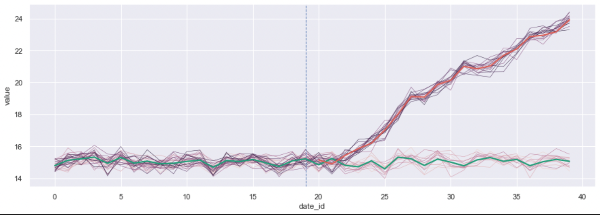

# Sub-time-series clustering

Sub-time-series clustering (stsc) attempts to find clusters of time-series at given intervals of time. Unlike time-series clustering, the clustering is allowed to change through time to better fit the data. This repository provides models and functions that approximation optimal stsc.

## How to use 

The file: test.ipynb contains a notebook that uses greedy2, the main algorithm proposed. The notebook also showcases the plotting functionality contained to the plotUtils file.

## References

Agarwal, Pankaj K., et al. "Subtrajectory clustering: Models and algorithms." Proceedings of the 37th ACM SIGMOD-SIGACT-SIGAI Symposium on Principles of Database Systems. 2018.